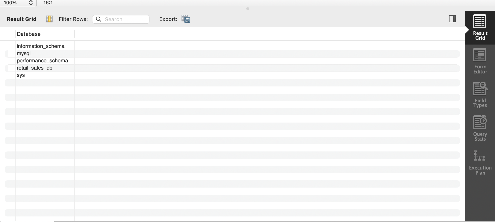
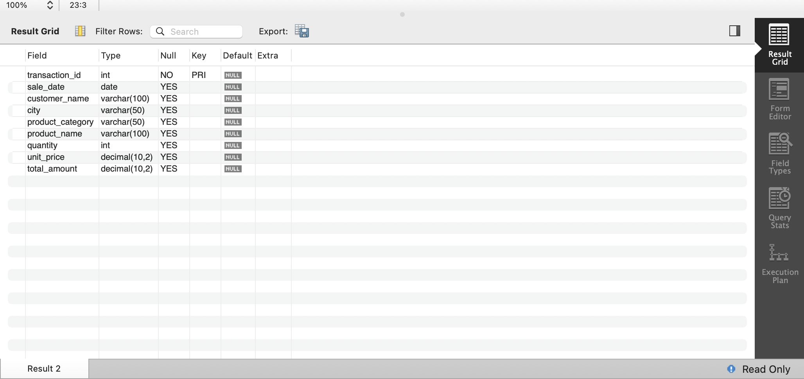
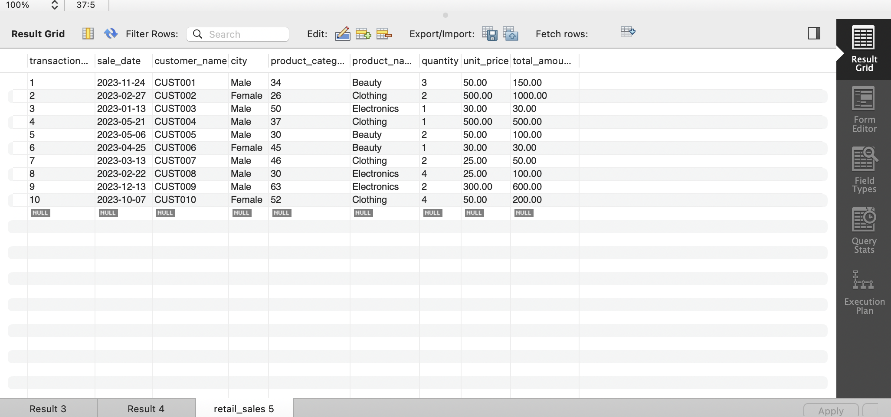
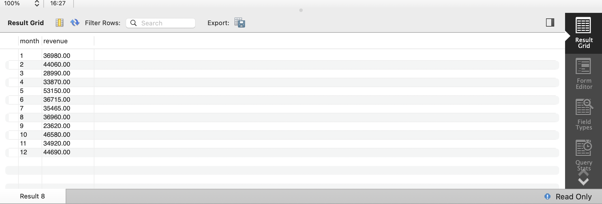
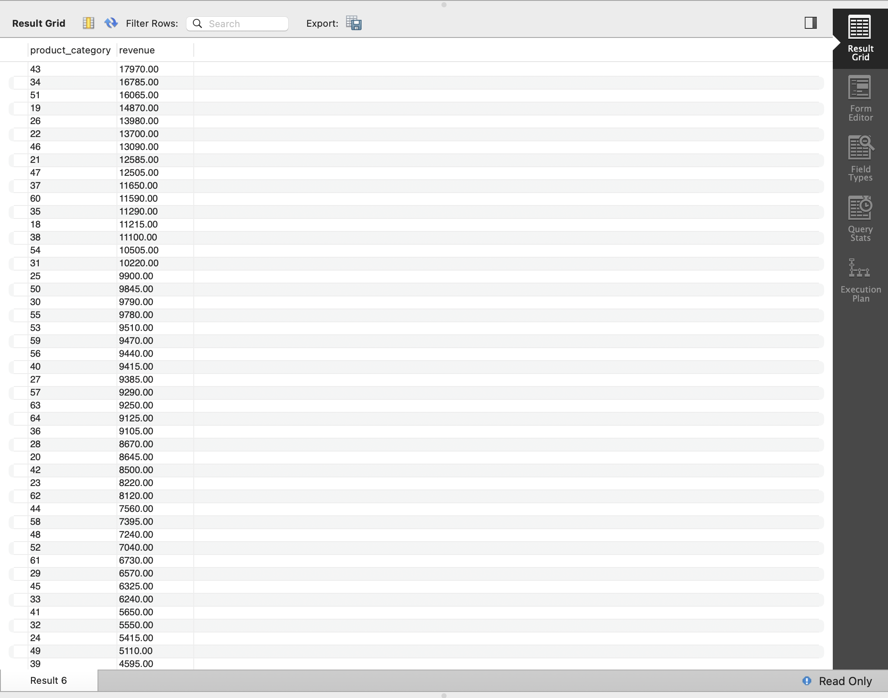
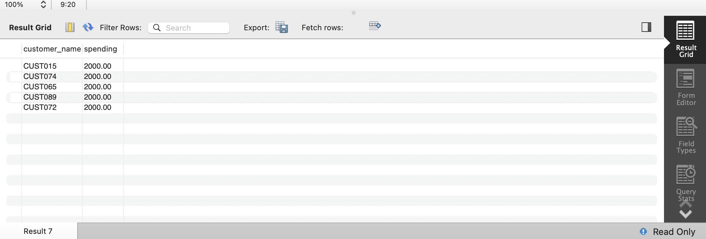

# 📊 Retail Sales SQL Analysis

A complete SQL project analyzing retail sales data using MySQL Workbench. This project demonstrates database creation, data importing, SQL querying, and business insight generation from retail transaction data.

---

## 🎯 Project Objectives

- Create and manage a MySQL database
- Import retail sales data from CSV
- Perform revenue analysis
- Identify top customers
- Analyze monthly sales trends
- Generate business insights using SQL

---

## 🛠️ Tools Used

- 🐬 MySQL Workbench
- 📝 SQL
- 💻 VS Code
- 🌐 GitHub
- 📊 Kaggle Dataset

---

## 📂 Dataset Information

**Dataset:** Retail Sales Dataset

**Author:** Mohammad Talib

**Source:** Kaggle

### Dataset Features

- Transaction ID
- Sale Date
- Customer Name
- City
- Product Category
- Product Name
- Quantity
- Unit Price
- Total Amount

---

## 🗄️ Database Creation

### Create Database

```sql
CREATE DATABASE retail_sales_db;
USE retail_sales_db;
```

### 📸 Database Created



---

## 🧱 Table Structure

### Create Table

```sql
CREATE TABLE retail_sales (
    transaction_id INT PRIMARY KEY,
    sale_date DATE,
    customer_name VARCHAR(100),
    city VARCHAR(50),
    product_category VARCHAR(50),
    product_name VARCHAR(100),
    quantity INT,
    unit_price DECIMAL(10,2),
    total_amount DECIMAL(10,2)
);
```

### 📸 Table Structure



---

## 📥 Data Import

The CSV dataset was imported into MySQL Workbench and loaded into the `retail_sales` table.

### 📸 Imported Data



---

# 🔍 SQL Analysis Queries

## 1️⃣ Monthly Revenue Trend

```sql
SELECT
    MONTH(sale_date) AS month,
    SUM(total_amount) AS revenue
FROM retail_sales
GROUP BY month
ORDER BY month;
```

### 📸 Output



---

## 2️⃣ Revenue by Product Category

```sql
SELECT
    product_category,
    SUM(total_amount) AS revenue
FROM retail_sales
GROUP BY product_category
ORDER BY revenue DESC;
```

### 📸 Output



---

## 3️⃣ Top 5 Customers by Spending

```sql
SELECT
    customer_name,
    SUM(total_amount) AS spending
FROM retail_sales
GROUP BY customer_name
ORDER BY spending DESC
LIMIT 5;
```

### 📸 Output



---

# 📈 Key Insights

### 💰 Revenue Analysis

- Product categories contributed differently to overall revenue.
- Revenue analysis helps identify high-performing product groups.

### 📅 Monthly Trends

- Revenue varied across different months.
- Monthly analysis helps understand sales patterns and seasonality.

### 👥 Customer Analysis

- Top customers generated significantly higher spending compared to others.
- Identifying high-value customers supports targeted business strategies.

---

# 💡 SQL Concepts Used

- CREATE DATABASE

- Data Import
  
- CREATE TABLE
  
- SELECT

- WHERE

- GROUP BY

- ORDER BY

- LIMIT

- COUNT()

- SUM()

- Aggregate Functions

- Business Analytics

---

## 📁 Project Structure

```text
Retail-Sales-SQL-Analysis/
│
├── retail_sales_dataset.csv
├── SQL_Queries.sql
├── README.md
│
└── screenshots/
    ├── database_created.png
    ├── table_structure.png
    ├── data_imported.png
    ├── monthly_revenue.png
    ├── revenue_by_category.png
    └── top_customers.png
```

---

# 🚀 How to Run

### 1. Clone the Repository

```bash
git clone https://github.com/Unnati22p/Retail-Sales-SQL-Analysis.git
```

### 2. Open MySQL Workbench

### 3. Create Database and Table

Run the SQL commands from:

```text
SQL_Queries.sql
```

### 4. Import Dataset

Import:

```text
retail_sales_dataset.csv
```

into the `retail_sales` table.

### 5. Execute Queries

Run the SQL queries to generate insights and results.

---

# ⭐ Project Outcome

This project demonstrates practical SQL skills used in real-world data analysis, including database creation, data management, revenue analysis, customer analysis, and business reporting.

---

## 👨‍💻 Author

**Unnati Patil**

Aspiring Data Analyst | SQL | Python | Data Analytics

---

### ⭐ If you found this project useful, feel free to star the repository!
